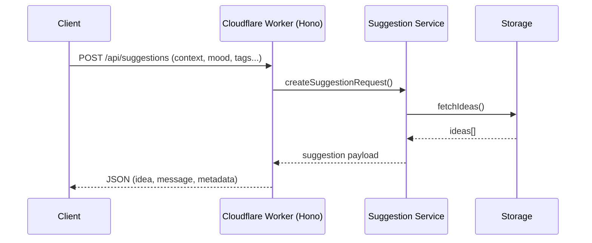

# Suggestman

自由時間が突然生まれた瞬間に、「本当にやりたいこと」を提示してくれるサジェスト専用の Cloudflare Worker アプリケーションです。
このドキュメントでは、実装に向けた技術構成とアーキテクチャの初期方針を整理します。

## システム構成
- **フロントエンド**: 現在は未定（将来的には Web / モバイルなど複数クライアントからの呼び出しを想定）
- **API 層**: Cloudflare Workers 上にデプロイされた Hono アプリケーション
  - リクエストルーターとバリデーション
  - 提案ロジックを呼び出すサービス層
- **ストレージ**: Cloudflare D1（SQLite ベース）
  - MVP では D1 をメインデータストアとし、アイデアや提案履歴を保持

## リクエストフロー
1. クライアントが Worker のエンドポイントへ HTTP リクエストを送信
2. Hono がリクエストを受け取り、入力パラメータ（気分、タグなど）をバリデーション
3. サジェストサービスが候補リストを取得し、フィルタ・優先順位付けを実行
4. 選定したアイデアを JSON レスポンスとして返却



## 想定エンドポイント
- `POST /api/suggestions`
  - ボディ: `{ "mood": "low_energy", "includeTags": ["indoor"], "excludeIds": ["idea_123"] }`
  - レスポンス: `{ "idea": {...}, "motivationalMessage": "...", "servedAt": "2024-..." }`
- `POST /api/ideas`
  - ボディ: `{ "title": "...", "tags": ["indoor"], "note": "..." }`
  - 役割: ユーザーが事前に「やりたいこと」を登録する（MVP 時点で管理 UI が無くても API 経由で登録可能にしておく）
- `GET /api/ideas`
  - 登録済みアイデアの取得。将来的な管理 UI のための下準備。

※ 実際のエンドポイント構成は実装フェーズで調整予定。

## サジェストロジック概要
- 入力: ユーザーの気分・タグ・除外リストなどのコンテキスト
- プロセス:
  1. ストレージから候補アイデアを取得
  2. コンテキストに応じたフィルタリング（タグ一致、スヌーズ中アイデアの除外など）
  3. 直近に提示した候補を避けるためのクールダウンチェック
  4. ランダムまたは重み付けによる最終選定
- 出力: 選定したアイデアと後押しメッセージ

## ローカル開発
1. 依存関係をインストール
   ```bash
   npm install
   ```
2. 開発サーバーを起動
   ```bash
   npm run dev
   ```
3. 別ターミナルまたはブラウザから確認
   ```bash
   curl http://127.0.0.1:8787/
   # => {"message":"Hello, Suggestman!","timestamp":"..."}
   ```
4. D1 へ疎通確認
   ```bash
   curl http://127.0.0.1:8787/ideas
   # => {"ideas":[]}
   ```

### Node.js バージョン
- `.nvmrc` で Node.js 20 系を指定しています。`nvm use` または `nvm install` で環境を揃えてから `npm install` を実行してください。

### Cloudflare D1 セットアップ
1. データベース作成（初回のみ）
   ```bash
   npx wrangler d1 create suggestman
   ```
   表示された `database_id` を `wrangler.toml` の `[[d1_databases]]` セクションへ反映してください。
2. マイグレーション適用
   ```bash
   npx wrangler d1 migrations apply suggestman --local
   # 本番は --local を外して実行
   ```
3. 手動クエリ例
   ```bash
   npx wrangler d1 execute suggestman --local --command "SELECT * FROM ideas;"
   ```

## 開発ロードマップ（抜粋）
- [x] Hono プロジェクトの初期セットアップ
- [ ] `POST /api/suggestions` の仮実装（ダミーデータ返却）
- [ ] ストレージアクセスレイヤと CRUD API の整備
- [ ] 提案アルゴリズムの MVP 版実装（クールダウンを含む）
- [ ] ロギング/監視の初期設計（Cloudflare Logs, Sentry 等の検討）

## 運用メモ
- 環境変数は Cloudflare Worker のシークレット（`wrangler secret`）で管理
- ローカル開発は `wrangler dev` を利用し、Hono のテストは Vitest などで補完予定
- デプロイは `wrangler deploy` による CI/CD パイプライン化を視野に入れる
