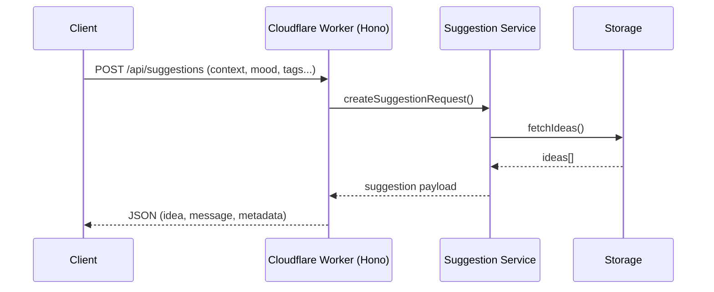

# Suggestman

自由時間が突然生まれた瞬間に、「本当にやりたいこと」を提示してくれるサジェスト専用の Cloudflare Worker アプリケーションです。
このドキュメントでは、実装に向けた技術構成とアーキテクチャの初期方針を整理します。

## システム構成
- **フロントエンド**: Hono JSX による SSR（MVP）+ 外部 JavaScript による動的処理
- **API 層**: Cloudflare Workers 上にデプロイされた Hono アプリケーション
  - リクエストルーターとバリデーション
  - 提案ロジックを呼び出すサービス層
- **認証**: GitHub OAuth + パスワード認証のハイブリッド
  - JWT によるステートレス認証（Cookie に保存）
- **ストレージ**: Cloudflare D1（SQLite ベース）+ Workers KV
  - **プライマリストレージ**: D1 にユーザー、アイデア、提案履歴を保存
  - **クールダウン管理**: Workers KV で期限付きデータ管理（7日間 TTL）

## リクエストフロー
1. クライアントが Worker のエンドポイントへ HTTP リクエストを送信
2. Hono がリクエストを受け取り、入力パラメータ（気分、タグなど）をバリデーション
3. サジェストサービスが候補リストを取得し、フィルタ・優先順位付けを実行
4. 選定したアイデアを JSON レスポンスとして返却



## ローカル開発

### 環境変数の設定

**重要**: ローカル開発用の環境変数を設定する必要があります。

1. `.dev.vars.example` をコピーして `.dev.vars` を作成
   ```bash
   cp .dev.vars.example .dev.vars
   ```

2. `.dev.vars` に実際の値を設定
   ```bash
   # GitHub OAuth アプリケーションを作成: https://github.com/settings/developers
   GITHUB_CLIENT_ID=your_github_client_id
   GITHUB_CLIENT_SECRET=your_github_client_secret

   # JWT シークレットを生成（32バイト以上のランダム文字列）
   JWT_SECRET=$(openssl rand -base64 32)
   ```

3. **⚠️ セキュリティ注意事項**:
   - `.dev.vars` は絶対に Git にコミットしないでください（`.gitignore` に含まれています）
   - 本番環境では `wrangler secret put` コマンドを使用してシークレットを設定してください
   - GitHub Client Secret は定期的にローテーションすることを推奨します

### 開発手順

1. 依存関係をインストール
   ```bash
   npm install
   ```
2. Husky のセットアップ（初回のみ）
   ```bash
   # Husky を初期化
   npx husky init

   # pre-commit フックに実行権限を付与
   chmod +x .husky/pre-commit
   ```
3. 開発サーバーを起動
   ```bash
   npm run dev
   ```
4. 別ターミナルまたはブラウザから確認
   ```bash
   curl http://127.0.0.1:8787/
   # => {"message":"Hello, Suggestman!","timestamp":"..."}
   ```
5. D1 へ疎通確認
   ```bash
   curl http://127.0.0.1:8787/ideas
   # => {"ideas":[]}
   ```

### Node.js バージョン
- `.nvmrc` で Node.js 20 系を指定しています。`nvm use` または `nvm install` で環境を揃えてから `npm install` を実行してください。

### Cloudflare D1 セットアップ
1. データベース作成（初回のみ）
   ```bash
   npx wrangler d1 create suggestman
   ```
   表示された `database_id` を `wrangler.toml` の `[[d1_databases]]` セクションへ反映してください。
2. マイグレーション適用
   ```bash
   npx wrangler d1 migrations apply suggestman --local
   # 本番は --local を外して実行
   ```
3. 手動クエリ例
   ```bash
   npx wrangler d1 execute suggestman --local --command "SELECT * FROM ideas;"
   ```

## 開発ロードマップ（抜粋）
- [x] Hono プロジェクトの初期セットアップ
- [x] 認証システムの実装（GitHub OAuth + パスワード認証）
- [x] ユーザー管理とダッシュボードの基本実装
- [ ] アイデア管理 CRUD API の実装
- [ ] `POST /api/suggestions` の実装（提案アルゴリズム MVP 版）
- [ ] クールダウン機能の実装（Workers KV 使用）
- [ ] ロギング/監視の初期設計（Cloudflare Logs, Sentry 等の検討）

## 運用メモ
- 環境変数は Cloudflare Worker のシークレット（`wrangler secret`）で管理
- ローカル開発は `wrangler dev` を利用し、Hono のテストは Vitest などで補完予定
- デプロイは `wrangler deploy` による CI/CD パイプライン化を視野に入れる

## セキュリティ

セキュリティに関する情報は [SECURITY.md](./SECURITY.md) をご覧ください。

脆弱性を発見した場合は、公開の Issue ではなく、メンテナに直接ご連絡ください。

## ライセンス

このプロジェクトは MIT ライセンスの下で公開されています。詳細は [LICENSE](./LICENSE) ファイルをご覧ください。


### 開発ガイドライン

- [CLAUDE.md](./CLAUDE.md): Claude Code を使った開発ガイド
- [AGENTS.md](./AGENTS.md): 仮想エージェントチームの役割と連携

### コーディング規約

- Biome による Lint とフォーマット
- TypeScript strict モード有効

#### Git コミット前の自動チェック（Husky）

このプロジェクトでは、[Husky](https://typicode.github.io/husky/) を使用して Git コミット前に自動的にコードフォーマットとリントチェックを実行します。

**動作:**
- `git commit` 実行時に自動的に以下が実行されます:
  1. `npm run format` - コードの自動フォーマット
  2. `npm run lint` - リントチェック
- リントエラーがある場合はコミットが中止されます

**手動でスキップする場合（非推奨）:**
```bash
git commit --no-verify -m "your message"
```

**注意:** 通常は自動チェックに従い、エラーを修正してからコミットしてください。
