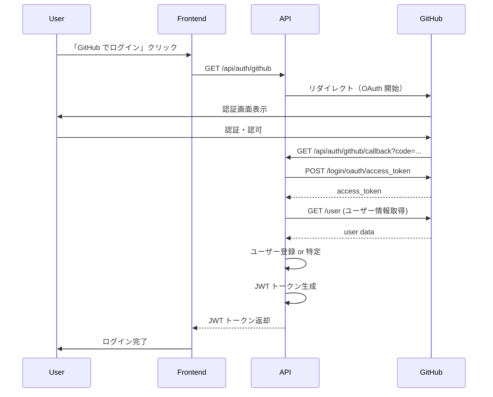
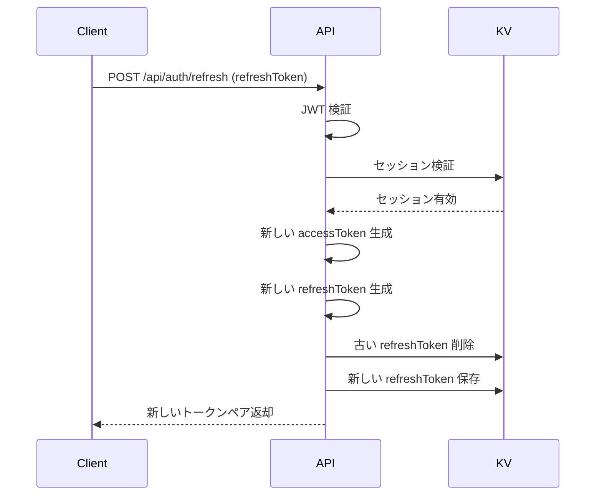

# 認証仕様書

## 概要

Suggestman の認証・認可システムの仕様を定義します。
**GitHub OAuth** と **メールアドレス/パスワード** の2つの認証方式をサポートし、**JWT トークン**でセッション管理を行います。

---

## 認証方式

### 1. GitHub OAuth 2.0 認証

#### フロー


#### 実装詳細

**1. OAuth 開始** (`GET /api/auth/github`)
- GitHub OAuth URL へリダイレクト:
  ```
  https://github.com/login/oauth/authorize?
    client_id={GITHUB_CLIENT_ID}&
    redirect_uri={CALLBACK_URL}&
    scope=user:email&
    state={CSRF_TOKEN}
  ```
- `scope`: `user:email`（メールアドレス取得のため）
- `state`: CSRF 対策用のランダム文字列（セッションに保存）

**2. コールバック処理** (`GET /api/auth/github/callback`)
1. `code` パラメータを取得
2. `state` パラメータを検証（CSRF 対策）
3. GitHub に access_token をリクエスト:
   ```
   POST https://github.com/login/oauth/access_token
   {
     "client_id": "{GITHUB_CLIENT_ID}",
     "client_secret": "{GITHUB_CLIENT_SECRET}",
     "code": "{code}"
   }
   ```
4. GitHub API でユーザー情報を取得:
   ```
   GET https://api.github.com/user
   Headers: Authorization: token {access_token}
   ```
5. `githubId` でユーザーを検索:
   - 存在する場合: 既存ユーザーとしてログイン
   - 存在しない場合: 新規ユーザーを作成
6. JWT トークンを生成
7. フロントエンドへリダイレクト、またはJSON レスポンス

**エラーハンドリング**:
- GitHub 認証失敗: `401 Unauthorized`
- state 検証失敗: `400 Bad Request`
- その他のエラー: `500 Internal Server Error`

---

### 2. メールアドレス/パスワード認証

#### 新規登録フロー

**エンドポイント**: `POST /api/auth/signup`

1. リクエストデータのバリデーション
2. メールアドレスの重複チェック
3. パスワードのハッシュ化（bcrypt、cost=10）
4. ユーザーデータを KV に保存
5. メールアドレス→ユーザーID マッピングを保存
6. JWT トークンを生成
7. レスポンス返却

**パスワード要件**:
- 最小8文字、最大72文字
- 英大文字、英小文字、数字、記号のうち3種類以上を含む
- 一般的な弱いパスワードは拒否（オプション）

**パスワードハッシュ**:
- アルゴリズム: bcrypt
- Cost factor: 10
- ソルト: bcrypt が自動生成

#### ログインフロー

**エンドポイント**: `POST /api/auth/login`

1. メールアドレスでユーザーを検索
2. パスワードハッシュを検証
3. 検証成功時:
   - JWT トークンを生成
   - 最終ログイン日時を更新
4. レスポンス返却

**セキュリティ対策**:
- パスワード検証失敗時も同じエラーメッセージ（タイミング攻撃対策）
- ログイン失敗時のレート制限（5回/分）
- 連続失敗時のアカウントロック（オプション、将来実装）

---

## JWT トークン仕様

### トークンの種類

#### 1. アクセストークン (Access Token)
- **有効期限**: 1時間（3600秒）
- **用途**: API リクエストの認証
- **保存場所**: メモリ、または localStorage（XSS リスクあり）

#### 2. リフレッシュトークン (Refresh Token)
- **有効期限**: 30日間（2592000秒）
- **用途**: アクセストークンの再発行
- **保存場所**: HttpOnly Cookie（推奨）、または localStorage

### JWT ペイロード

**アクセストークン**:
```json
{
  "sub": "user_abc123def456",
  "email": "user@example.com",
  "name": "User Name",
  "type": "access",
  "iat": 1642252800,
  "exp": 1642256400
}
```

**リフレッシュトークン**:
```json
{
  "sub": "user_abc123def456",
  "type": "refresh",
  "sessionId": "session_xyz789",
  "iat": 1642252800,
  "exp": 1644844800
}
```

**フィールド説明**:
- `sub`: ユーザー ID（Subject）
- `email`: メールアドレス（アクセストークンのみ）
- `name`: 表示名（アクセストークンのみ）
- `type`: トークンタイプ（`access` または `refresh`）
- `sessionId`: セッション ID（リフレッシュトークンのみ）
- `iat`: 発行日時（Issued At）
- `exp`: 有効期限（Expiration Time）

### 署名アルゴリズム
- **アルゴリズム**: HS256（HMAC-SHA256）
- **シークレット**: 環境変数 `JWT_SECRET`（最低256ビット）

### トークン検証

**検証項目**:
1. 署名の正当性
2. 有効期限（`exp` > 現在時刻）
3. トークンタイプ（`type` フィールド）
4. 発行日時（`iat` <= 現在時刻）

**検証失敗時のレスポンス**:
- `401 Unauthorized`
- エラーコード: `TOKEN_INVALID`, `TOKEN_EXPIRED`, `TOKEN_MALFORMED`

---

## 認証ミドルウェア

### 実装要件

```typescript
async function authMiddleware(c: Context, next: Next) {
  // 1. Authorization ヘッダーを取得
  const authHeader = c.req.header('Authorization')

  // 2. Bearer トークンを抽出
  if (!authHeader || !authHeader.startsWith('Bearer ')) {
    return c.json({ error: 'Unauthorized' }, 401)
  }

  const token = authHeader.substring(7)

  // 3. JWT を検証
  try {
    const payload = await verifyJWT(token, JWT_SECRET)

    // 4. トークンタイプを確認
    if (payload.type !== 'access') {
      return c.json({ error: 'Invalid token type' }, 401)
    }

    // 5. ユーザー情報を context に追加
    c.set('userId', payload.sub)
    c.set('userEmail', payload.email)
    c.set('userName', payload.name)

    await next()
  } catch (error) {
    return c.json({ error: 'Token verification failed' }, 401)
  }
}
```

### 適用エンドポイント

**認証不要**:
- `POST /api/auth/signup`
- `POST /api/auth/login`
- `GET /api/auth/github`
- `GET /api/auth/github/callback`
- `POST /api/auth/refresh`

**認証必須**:
- `POST /api/auth/logout`
- `POST /api/ideas`
- `GET /api/ideas`
- `GET /api/ideas/:id`
- `PUT /api/ideas/:id`
- `DELETE /api/ideas/:id`
- `POST /api/suggestions`
- `POST /api/suggestions/:id/feedback`

---

## セッション管理

### セッション作成
- ログイン成功時に新しいセッション ID を生成
- セッション情報を KV に保存（TTL: 7日間）
- セッション ID をリフレッシュトークンに含める

### セッション検証
- リフレッシュトークン使用時にセッションの有効性を確認
- セッションが存在しない場合は再ログイン要求

### セッション削除
- ログアウト時にセッションを KV から削除
- リフレッシュトークンも無効化

---

## トークンリフレッシュフロー



**実装詳細**:
1. リフレッシュトークンを検証
2. セッション ID を取得
3. KV でセッションの有効性を確認
4. 新しいアクセストークンを生成
5. 新しいリフレッシュトークンを生成（推奨）
6. 古いリフレッシュトークンを無効化
7. レスポンス返却

---

## セキュリティ要件

### パスワードセキュリティ
- ✅ bcrypt でハッシュ化（cost=10）
- ✅ パスワードの複雑性要件
- ✅ 平文パスワードをログに出力しない
- ⏳ パスワードリセット機能（将来実装）
- ⏳ 2要素認証（将来実装）

### トークンセキュリティ
- ✅ HTTPS 必須（本番環境）
- ✅ JWT シークレットは環境変数で管理
- ✅ トークンの短い有効期限（1時間）
- ✅ リフレッシュトークンローテーション
- ⏳ トークンブラックリスト（将来実装）

### CSRF 対策
- ✅ GitHub OAuth の state パラメータ
- ✅ HttpOnly Cookie の使用（リフレッシュトークン）
- ✅ SameSite 属性の設定

### XSS 対策
- ✅ HttpOnly Cookie でトークン保存（推奨）
- ✅ Content-Security-Policy ヘッダー
- ✅ 入力値のサニタイゼーション

### レート制限
- ✅ ログイン: 5回/分/IP
- ✅ 登録: 3回/時/IP
- ✅ リフレッシュ: 10回/分/ユーザー

---

## エラーハンドリング

### 認証エラー

**401 Unauthorized**:
```json
{
  "success": false,
  "error": {
    "code": "UNAUTHORIZED",
    "message": "Authentication required"
  }
}
```

**トークン期限切れ**:
```json
{
  "success": false,
  "error": {
    "code": "TOKEN_EXPIRED",
    "message": "Access token has expired",
    "hint": "Use refresh token to obtain a new access token"
  }
}
```

**認証情報不正**:
```json
{
  "success": false,
  "error": {
    "code": "INVALID_CREDENTIALS",
    "message": "Invalid email or password"
  }
}
```

---

## テストケース

### 単体テスト
- ✅ パスワードハッシュ化と検証
- ✅ JWT 生成と検証
- ✅ トークン有効期限チェック
- ✅ 認証ミドルウェアの動作

### 統合テスト
- ✅ 新規登録フロー（メール/パスワード）
- ✅ ログインフロー（メール/パスワード）
- ✅ GitHub OAuth フロー
- ✅ トークンリフレッシュフロー
- ✅ ログアウトフロー
- ✅ 認証エラーハンドリング

---

## 監視とログ

### ログ出力項目
- ログイン成功/失敗（ユーザーID、IP アドレス）
- トークン発行（ユーザーID、トークンタイプ）
- 認証エラー（エラータイプ、IP アドレス）
- セッション作成/削除

### アラート条件
- ログイン失敗率が 10% 超過
- 同一 IP からの連続ログイン失敗（5回以上）
- トークン検証エラー率が 5% 超過

---

## GDPR 対応

### データ保持
- セッション: 7日間（TTL で自動削除）
- リフレッシュトークン: 30日間（TTL で自動削除）
- ログ: 90日間

### ユーザー権利
- **アクセス権**: ユーザーは自分のアカウント情報を取得可能
- **削除権**: アカウント削除時は全関連データを30日以内に削除
- **訂正権**: ユーザーは自分の情報を更新可能

---

## 将来の拡張

### OAuth プロバイダー追加
- Google OAuth
- Twitter OAuth
- Apple Sign In

### 2要素認証（2FA）
- TOTP（Time-based One-Time Password）
- SMS 認証
- メール認証コード

### パスワードレス認証
- マジックリンク（メール）
- WebAuthn（生体認証）

### エンタープライズ機能
- SAML SSO
- LDAP 統合
- チーム管理
