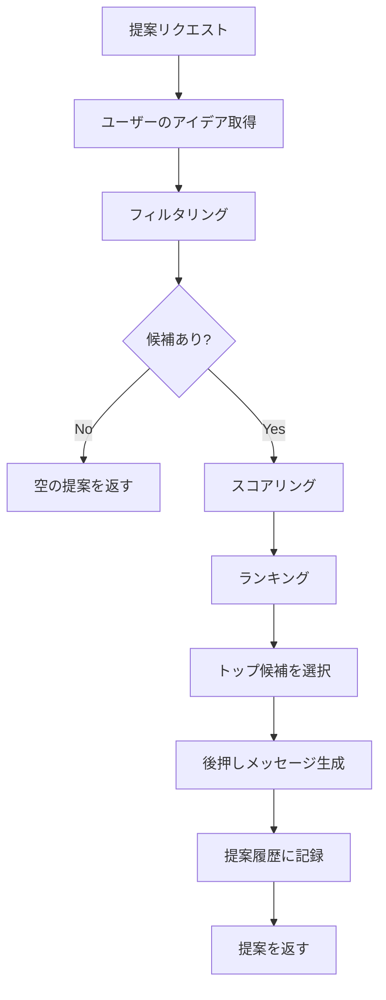

# 機能仕様書

## 概要

Suggestman のコア機能であるアイデア提案システムの仕様を定義します。
ユーザーのコンテキスト（気分、時間、タグ）に基づいて、最適なアイデアを提案します。

---

## 提案アルゴリズム

### 1. 提案フロー



### 2. フィルタリング

ユーザーのコンテキストに基づいて、候補アイデアを絞り込みます。

#### フィルタリング条件

##### 2.1 クールダウンフィルター
**目的**: 同じアイデアを短期間で重複提示しない

**実装**:
```typescript
function filterCooldown(ideas: Idea[], userId: string): Promise<Idea[]> {
  // KV から各アイデアのクールダウン情報を取得
  const cooldownChecks = ideas.map(async (idea) => {
    const cooldownKey = `cooldown:${userId}:${idea.id}`
    const lastSuggested = await KV.get(cooldownKey)
    return { idea, inCooldown: lastSuggested !== null }
  })

  const results = await Promise.all(cooldownChecks)
  return results.filter(r => !r.inCooldown).map(r => r.idea)
}
```

**クールダウン期間**: 7日間（設定可能）

##### 2.2 タグフィルター
**目的**: ユーザーが指定したタグに一致/不一致のアイデアを絞り込む

**実装ロジック**:
- `includeTags` が指定された場合: 指定されたタグを**1つ以上**含むアイデアのみ
- `excludeTags` が指定された場合: 指定されたタグを**含まない**アイデアのみ

```typescript
function filterByTags(
  ideas: Idea[],
  includeTags?: string[],
  excludeTags?: string[]
): Idea[] {
  return ideas.filter(idea => {
    // includeTags チェック
    if (includeTags && includeTags.length > 0) {
      const hasIncludeTag = includeTags.some(tag =>
        idea.tags.includes(tag)
      )
      if (!hasIncludeTag) return false
    }

    // excludeTags チェック
    if (excludeTags && excludeTags.length > 0) {
      const hasExcludeTag = excludeTags.some(tag =>
        idea.tags.includes(tag)
      )
      if (hasExcludeTag) return false
    }

    return true
  })
}
```

##### 2.3 時間フィルター
**目的**: 利用可能な時間内で完了できるアイデアのみを提案

**実装**:
```typescript
function filterByTime(
  ideas: Idea[],
  availableMinutes?: number
): Idea[] {
  if (!availableMinutes) return ideas

  return ideas.filter(idea => {
    // estimatedMinutes が未設定の場合は候補に含める
    if (!idea.estimatedMinutes) return true
    // 利用可能時間内に完了できる場合のみ
    return idea.estimatedMinutes <= availableMinutes
  })
}
```

##### 2.4 除外リストフィルター
**目的**: ユーザーが明示的に除外したアイデアを排除

**実装**:
```typescript
function filterExcludedIdeas(
  ideas: Idea[],
  excludeIdeaIds?: string[]
): Idea[] {
  if (!excludeIdeaIds || excludeIdeaIds.length === 0) {
    return ideas
  }

  const excludeSet = new Set(excludeIdeaIds)
  return ideas.filter(idea => !excludeSet.has(idea.id))
}
```

---

### 3. スコアリング

候補アイデアに対してスコアを算出し、ランキングします。

#### スコアリング要素

##### 3.1 気分マッチスコア
**目的**: ユーザーの気分に適したアイデアを優先

**気分とタグのマッピング**:
```typescript
const MOOD_TAG_WEIGHTS: Record<string, Record<string, number>> = {
  high_energy: {
    outdoor: 1.5,
    physical: 1.5,
    social: 1.3,
    active: 1.4,
  },
  low_energy: {
    indoor: 1.5,
    solo: 1.3,
    relaxation: 1.5,
    entertainment: 1.2,
  },
  creative: {
    creative: 1.8,
    solo: 1.2,
    indoor: 1.1,
  },
  productive: {
    productive: 1.8,
    solo: 1.3,
    indoor: 1.2,
  },
  social: {
    social: 1.8,
    outdoor: 1.2,
    entertainment: 1.2,
  },
  solo: {
    solo: 1.8,
    indoor: 1.2,
  },
}
```

**スコア計算**:
```typescript
function calculateMoodScore(idea: Idea, mood?: string): number {
  if (!mood) return 1.0 // 気分指定なしの場合は中立スコア

  const tagWeights = MOOD_TAG_WEIGHTS[mood] || {}
  let score = 1.0

  for (const tag of idea.tags) {
    if (tagWeights[tag]) {
      score *= tagWeights[tag]
    }
  }

  return score
}
```

##### 3.2 履歴スコア
**目的**: 過去に高評価だったアイデアを優先

**実装**:
```typescript
function calculateHistoryScore(
  idea: Idea,
  history: SuggestionHistory[]
): number {
  // このアイデアの過去の履歴を取得
  const ideaHistory = history.filter(h => h.ideaId === idea.id)

  if (ideaHistory.length === 0) {
    return 1.0 // 履歴なしは中立スコア
  }

  // 平均評価を計算
  const ratings = ideaHistory
    .filter(h => h.feedback?.rating)
    .map(h => h.feedback!.rating!)

  if (ratings.length === 0) {
    return 1.0
  }

  const avgRating = ratings.reduce((sum, r) => sum + r, 0) / ratings.length

  // 評価を 0.5〜1.5 の範囲にマッピング
  return 0.5 + (avgRating / 5.0)
}
```

##### 3.3 新鮮度スコア
**目的**: 未提案のアイデアや長期間提案されていないアイデアを優先

**実装**:
```typescript
function calculateFreshnessScore(
  idea: Idea,
  history: SuggestionHistory[]
): number {
  const ideaHistory = history.filter(h => h.ideaId === idea.id)

  if (ideaHistory.length === 0) {
    return 1.5 // 未提案アイデアは高スコア
  }

  // 最後に提案された日時を取得
  const lastSuggested = new Date(
    Math.max(...ideaHistory.map(h => new Date(h.suggestedAt).getTime()))
  )
  const daysSinceLastSuggested =
    (Date.now() - lastSuggested.getTime()) / (1000 * 60 * 60 * 24)

  // 7日以上経過している場合は新鮮度スコアを上げる
  if (daysSinceLastSuggested >= 7) {
    return 1.3
  } else if (daysSinceLastSuggested >= 3) {
    return 1.1
  } else {
    return 1.0
  }
}
```

#### 総合スコア計算

```typescript
function calculateTotalScore(
  idea: Idea,
  context: SuggestionContext,
  history: SuggestionHistory[]
): number {
  const moodScore = calculateMoodScore(idea, context.mood)
  const historyScore = calculateHistoryScore(idea, history)
  const freshnessScore = calculateFreshnessScore(idea, history)

  // 各スコアの重み
  const weights = {
    mood: 0.5,
    history: 0.3,
    freshness: 0.2,
  }

  const totalScore =
    moodScore * weights.mood +
    historyScore * weights.history +
    freshnessScore * weights.freshness

  return totalScore
}
```

---

### 4. ランキングと選択

#### ランキング
スコアの高い順にアイデアをソートします。

```typescript
function rankIdeas(
  ideas: Idea[],
  scores: Map<string, number>
): Idea[] {
  return ideas.sort((a, b) => {
    const scoreA = scores.get(a.id) || 0
    const scoreB = scores.get(b.id) || 0
    return scoreB - scoreA
  })
}
```

#### 選択戦略

**MVP**: トップスコアのアイデアを選択

```typescript
function selectIdea(rankedIdeas: Idea[]): Idea | null {
  if (rankedIdeas.length === 0) return null
  return rankedIdeas[0]
}
```

**将来の拡張**:
- **Top-K ランダム選択**: 上位 K 件からランダムに選択（多様性向上）
- **Thompson Sampling**: 探索と活用のバランスを取る

---

## 後押しメッセージ生成

### メッセージの役割
提案されたアイデアに対して、ユーザーのモチベーションを高めるメッセージを生成します。

### メッセージテンプレート

#### 気分ベース

```typescript
const MOOD_MESSAGES: Record<string, string[]> = {
  high_energy: [
    "エネルギーが溢れている今が絶好のタイミングです！",
    "アクティブなあなたにぴったりの活動です。",
    "今の勢いを活かして楽しみましょう！",
  ],
  low_energy: [
    "リラックスしながら楽しめます。",
    "ゆったりとした時間を過ごしましょう。",
    "無理せず、自分のペースで楽しめます。",
  ],
  creative: [
    "創造力を発揮する絶好の機会です！",
    "インスピレーションが湧きそうですね。",
    "クリエイティブなあなたにぴったりです。",
  ],
  productive: [
    "生産的な時間を過ごせます。",
    "達成感を味わえる活動です。",
    "前に進む良い機会です。",
  ],
  social: [
    "人との繋がりを楽しみましょう。",
    "社交的なあなたにぴったりです。",
    "楽しい時間を過ごせそうです。",
  ],
  solo: [
    "一人の時間を大切に。",
    "自分と向き合う良い機会です。",
    "マイペースに楽しみましょう。",
  ],
}
```

#### マッチ理由の生成

```typescript
function generateMatchReasons(
  idea: Idea,
  context: SuggestionContext
): string[] {
  const reasons: string[] = []

  // タグマッチの理由
  if (context.includeTags) {
    const matchedTags = idea.tags.filter(tag =>
      context.includeTags!.includes(tag)
    )
    if (matchedTags.length > 0) {
      reasons.push(
        `${matchedTags.join('、')}のアクティビティを希望されています`
      )
    }
  }

  // 気分マッチの理由
  if (context.mood) {
    const moodMessages = {
      high_energy: '高エネルギーモードに適しています',
      low_energy: '低エネルギーモードに適しています',
      creative: 'クリエイティブな気分にぴったりです',
      productive: '生産的な気分に合っています',
      social: '社交的な気分に最適です',
      solo: '一人の時間にふさわしいです',
    }
    const message = moodMessages[context.mood as keyof typeof moodMessages]
    if (message) reasons.push(message)
  }

  // 時間マッチの理由
  if (context.availableMinutes && idea.estimatedMinutes) {
    if (idea.estimatedMinutes <= context.availableMinutes) {
      reasons.push(
        `利用可能な${context.availableMinutes}分で完了できます`
      )
    }
  }

  return reasons
}
```

#### メッセージ生成ロジック

```typescript
function generateMotivationalMessage(
  idea: Idea,
  context: SuggestionContext
): string {
  const mood = context.mood || 'default'
  const templates = MOOD_MESSAGES[mood] || MOOD_MESSAGES['default']

  // ランダムに1つ選択
  const randomIndex = Math.floor(Math.random() * templates.length)
  return templates[randomIndex]
}
```

---

## クールダウン機能

### クールダウンの目的
- 同じアイデアを短期間で繰り返し提案しない
- 多様性を保ち、ユーザーに新鮮な体験を提供

### 実装仕様

#### クールダウンの記録

```typescript
async function recordCooldown(
  userId: string,
  ideaId: string,
  durationDays: number = 7
): Promise<void> {
  const cooldownKey = `cooldown:${userId}:${ideaId}`
  const timestamp = new Date().toISOString()

  await KV.put(cooldownKey, timestamp, {
    expirationTtl: durationDays * 24 * 60 * 60, // 秒単位
  })
}
```

#### クールダウンのチェック

```typescript
async function isInCooldown(
  userId: string,
  ideaId: string
): Promise<boolean> {
  const cooldownKey = `cooldown:${userId}:${ideaId}`
  const value = await KV.get(cooldownKey)
  return value !== null
}
```

#### カスタマイズ可能な設定

将来的には、ユーザーごとにクールダウン期間をカスタマイズ可能にする：

```typescript
interface UserSettings {
  cooldownDays: number // デフォルト: 7
}
```

---

## フィードバック機能

### フィードバックの種類

#### アクション
- `accepted`: 提案を受け入れて実行した
- `skipped`: 提案をスキップした
- `snoozed`: 一時的にスヌーズ（将来的に再提案希望）

#### 評価（オプション）
- 1〜5 の星評価
- コメント（最大500文字）

### フィードバックの活用

#### 提案品質の向上
- 高評価のアイデアを優先的に提案
- 低評価のアイデアを提案頻度を下げる

#### 統計情報
- ユーザーごとの受容率
- アイデアごとの平均評価
- 気分ごとの提案精度

---

## パフォーマンス要件

### レスポンスタイム
- 提案生成: 200ms 以内（P95）
- フィルタリング: 50ms 以内
- スコアリング: 100ms 以内

### スケーラビリティ
- アイデア数: 最大 1000 件/ユーザー
- 提案履歴: 最大 100 件/ユーザー
- 同時リクエスト: 100 req/s

---

## テストケース

### フィルタリングテスト
- ✅ クールダウン中のアイデアが除外される
- ✅ includeTags に一致するアイデアのみ残る
- ✅ excludeTags に一致するアイデアが除外される
- ✅ 利用可能時間を超えるアイデアが除外される
- ✅ 明示的に除外されたアイデアが除外される

### スコアリングテスト
- ✅ 気分に合ったアイデアのスコアが高い
- ✅ 高評価アイデアのスコアが高い
- ✅ 未提案アイデアのスコアが高い
- ✅ 長期間提案されていないアイデアのスコアが上がる

### 統合テスト
- ✅ 提案フロー全体が正常に動作する
- ✅ 候補がない場合に空の提案を返す
- ✅ フィードバックが正しく記録される
- ✅ クールダウンが正しく動作する

---

## 将来の拡張

### 機械学習による提案
- ユーザー行動の学習
- コラボラティブフィルタリング
- コンテンツベースフィルタリング

### コンテキスト認識の強化
- 位置情報の活用
- 天気情報の活用
- 時間帯の考慮（朝/昼/夜）
- 曜日の考慮（平日/週末）

### ソーシャル機能
- アイデアの共有
- 友達への提案
- グループアクティビティの提案

### ゲーミフィケーション
- 達成バッジ
- ストリーク（連続実行日数）
- チャレンジモード
